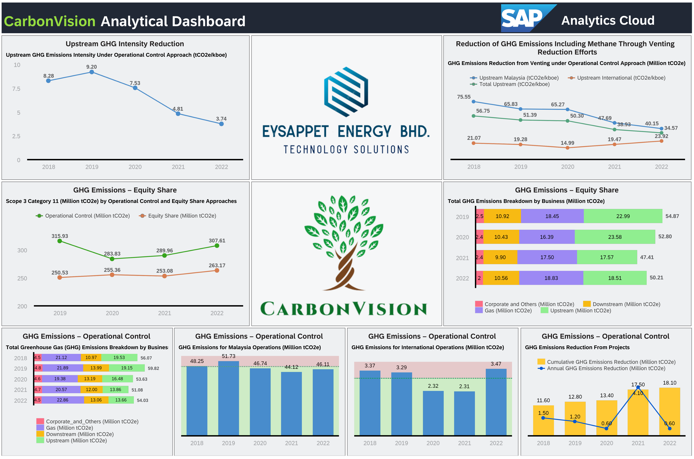

# Carbon Vision - EY Young Technology Professional Challenge 2023

## Project Overview

**Carbon Vision** is a cutting-edge web application developed as part of the EY Young Technology Professional Challenge 2023. This project focuses on Carbon Tracking & Reduction, providing a comprehensive solution to monitor and mitigate carbon emissions. The application integrates various functionalities, including an Analytical Dashboard, Scorecard Report, AI Chatbot Consultant services, Data Viewer, Carbon Offset Project showcase, and Gamification elements.

## Key Features

### 1. Analytical Dashboard
   
   - Real-time visualization of carbon emissions data.
   - Interactive charts and graphs for insightful analysis.

### 2. Scorecard Report
   
   
   - Comprehensive reports on carbon reduction achievements.
   - Benchmarking against set targets.

### 3. AI Chatbot Consultant
   
   - AI-powered chatbot for personalized carbon reduction advice.
   - Natural language processing for user-friendly interactions.

### 4. Data Viewer
   
   - User-friendly interface to explore detailed carbon data.
   - Filtering and sorting options for a customized viewing experience.

### 5. Carbon Offset Project Showcase
   
   - Showcase of carbon offset projects supported by the platform.
   - Information on environmental impact and contributions.

### 6. Gamification Elements
   
   
   - Engaging gamification features to encourage sustainable practices.
   - Rewards and recognition for users contributing to carbon reduction.

## Technologies Used

- **SAP Business Technology Platform (BTP):** Integrated for seamless data management and application development.
- **SAP Analytics Cloud:** Utilized for advanced analytics and data visualization.
- **Fiori Apps:** Employed for a consistent and intuitive user experience.
- **SAP HANA:** Used as the backend database for efficient data processing.
- **UI5 (User Interface 5):** Ensured a responsive and user-friendly front-end.
- **Node.js:** Implemented for server-side development and application logic.

## License

This project is licensed under the [MIT License](LICENSE.md) - see the [LICENSE.md](LICENSE.md) file for details.

## Acknowledgments

We express our gratitude to the EY Young Technology Professional Challenge 2023 for providing the platform to innovate and address critical environmental challenges. Together, let's create a sustainable and carbon-conscious future!

**Contributors:**
1. TAN KUANG JACK
2. TIOW KIT KEONG
3. LEONG KAH CHUN
